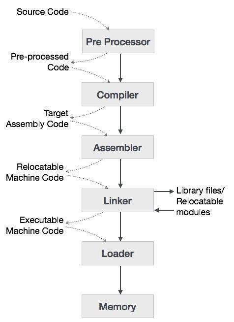
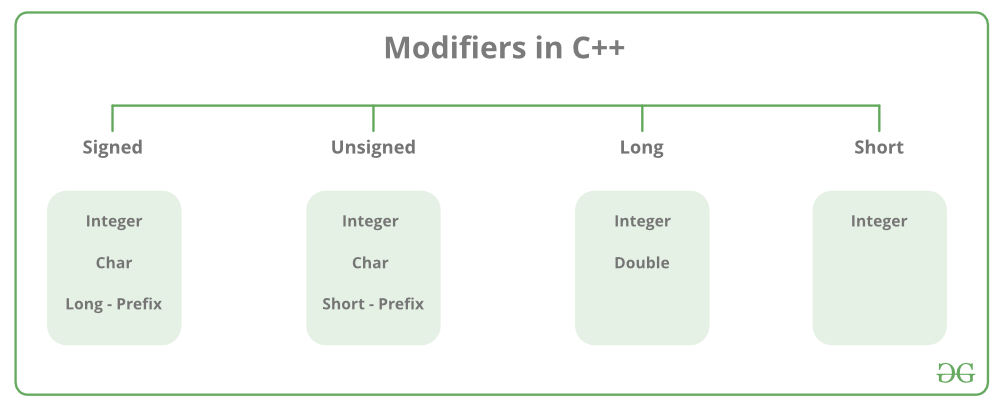
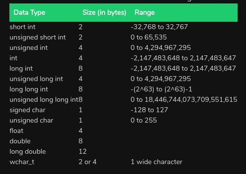
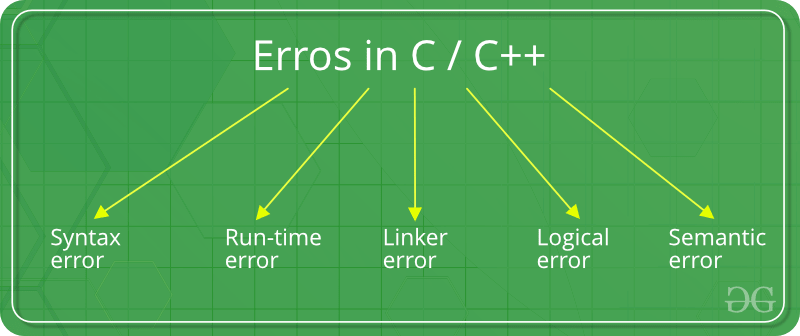

# Cpp Basics
 ## A Brief about compiler

   
  
  1. **Preprocessor-** Preprocessors are programs that process our source code before compilation. preprocessor directives(tells the compiler to pre process the code) begin with a ‘#’. There are 3 main types of preprocessor directives:
      - **Macros-** Macros are a piece of code in a program which is given some name define by "#define" directive. Whenever this name is encountered by the compiler the compiler replaces the name with the actual piece of code.
         ```cpp
            #define LIMIT 5 
            #define AREA(l, b) (l * b)
        ```
      - **File inclusion-** It tells the compiler to include a file in the source code program. There can be two types of files:
        - **Header Files-** These files contains definition of pre-defined functions. Ex- I/O functions are in ‘iostream’
        - **user defined files-** When a program becomes very large, it is good practice to divide it into smaller files and include whenever needed.
            ```c++
                #include "filename.cpp"
            ```
      - **Conditional Compiling-** It helps to compile a specific portion of the program or to skip compilation of some specific part of the program based on some conditions.
            
           ```c++
               #ifndef ONLINE_JUDGE
                    freopen("input.txt","r",stdin);
                    freopen("output.txt","w",stdout);
                #endif
           ```  

  2. **Compiler/Interpretor-** Both converts high level language into assembly language but compiler reads whole source code at once whereas interpreator read line by line.

  3. **Assembler-** It translates assembly language programs into machine code, its output is combination of machine instructions and data required to place these instructions in memory.

  4. **Linker-** It links various object file together to make an executable file. It searches and locates referenced modules and determine memory location where these code will be loaded

  5. **Loader-** It loads executable file in memory. It calculates size of program and create memory space for it.

  ## First Program
 ```c++
    #include <iostream>
    using namespace std;
    int main(){// every program should have it
        cout<<"Hello World!"<<endl;>
    }
```
 ## Declaration, Intialiazation, Assignment
   - **Declaration:** Declaration is when you declare a variable with a name
   
   - **Assignment:** throwing away the old value of a variable and replacing it with a new one.
   
   - **Intialization:** it's a special kind of assignment: the first. Before initialization objects have null value and primitive types have default values, can be done in conjugation with declaration
   
     ```c++
        // declaration
        string declaration;// memory allocated

        // Intialization
        string initialization = "initialization";
        declaration = "initialization"; //late initialization 
        
        // Assignment
        declaration = "assignment";
     ```

 ## Data Types
   
 
 ## DataType Modifier
 modify the length of data that a particular data type can hold.

   
   
   
  
  ### endl vs '\n'
   - **cout<<endl-** inserts new line and flushes the stream. It is equivalent to **cout << '\n' << flush;**
   - **cout<<"\n"** only insert a new line. 
   - endl is manipulator(Manipulators are operators used in C++ for formatting output) while \n is character.
   - endl doesn't occupy any memory whereas \n occupy memory.

 ## Input/ Output
  - **cout-** "<<" insertion operater inserts value of a variable to output stream.
  
  - **cin-** ">>" extraction operator extracts data from cin to variable.

  - **cerr-** used to report errors, it doesn't have buffer to store error message, hence displays immediately.
    ```c++
        cerr << "An error occured";
    ```
    
  - **clog-** used to display error but has buffer
    ```c++
        clog << "An error occured";
    ```
  - **Buffer-** All standard input and output devices contain an input and output buffer.  when we press the key on keyboard, it isn’t sent to your program, rather it is buffered
    ```c++
        // Causes only one write to underlying file instead of 5, buffer is flushed using endl.
        std::cout << a << " + " << b << " = " << std::endl; 
    ```
  - **getline()-**: getline() take input of a string that comprises of multiple words. When cin is followed by getline, it creates a problem.
    ```c++
        //INPUT:
        //      4
        //      Pradeep Kumar
        int a;
        cin>>a;
        string s;
        getline(cin, s);
        cout<<a<<" "<<s<<endl;// 1
        // When we provide input for a, not only 4 is submitted but 4\n, new line is always 
        // appended to input when we press enter, this new line is left in buffer after
        // extraction of 4 to a until the next I/O operation where it is either 
        // discarded or consumed. When the flow of control reaches std::getline(),
        // the newline will be discarded, but the input will cease immediately
        // because getline() attempts to read a line and stops when it finds a newline

        getline(cin, s);
        cout<<s<<endl;// Pradeep Kumar

        // solution
        int a;
        cin>>a;
        string s;
        cin.ignore();
        getline(cin, s);
        cout<<a<<" "<<s<<endl;// 1 Pradeep Kumar
    ```

 ## bits/stdc++
  It is basically a header file that includes every standard library. In programming contests, using this file is a good idea, when you want to reduce the time wasted in doing chores;
  ### Diadvantages
   - bits/stdc++.h is not a standard header file of GNU C++ library. So, if you try to compile your code with some compiler other than GCC it might fail; 

   - Using it would include a lot of unnecessary stuff and increases compilation time.
 
 ### What happen when we exceed valid range of built-in data types in C++?
    The variable takes value of other side, but bool behaves differently.
  ```c++
    int i1 = INT_MIN;
    cout<<i1<<" -> ";
    i1--;
    cout<<i1<<endl;// -2147483648 -> 2147483647

    int i2 = INT_MAX;
    cout<<i2<<" -> ";
    i2++;
    cout<<i2<<endl;// 2147483647 -> -2147483648

    char c = 127;
    cout<<int(c)<<" -> ";
    c++;
    cout<<int(c)<<endl;// 127 -> -128

    bool b = true;
    cout<<b<<" -> ";// when bool tries to become 2, 1 is assigned
    b++;
    cout<<b<<endl;// 1 -> 1

    bool b2 = false;
    b2--;// compilation error
  ```

 ### switch
   ```c++
        switch (n){
            case 1: // code to be executed if n = 1;

                break;

            case 2: // code to be executed if n = 2;

                break;

            default: // code to be executed if n doesn't match any cases
        }
   ```
 
 ## Precision of floating point numbers
  ### Floor
   Floor rounds off the given value to the closest integer which is less than the given value.
   ```c++
        double x =1.411, y =1.500, z =1.711;
        cout << floor(x) << endl;// 1
        cout << floor(y) << endl;// 1
        cout << floor(z) << endl;// 1

        double a =-1.411, b =-1.500, c =-1.611;
        cout << floor(a) << endl;// -2
        cout << floor(b) << endl;// -2
        cout << floor(c) << endl;// -2
   ```
  ### Ceil
   Ceil rounds off the given value to the closest integer which is more than the given value.
   ```c++
        double x =1.411, y =1.500, z =1.711;
        cout << ceil(x) << endl;// 2
        cout << ceil(y) << endl;// 2
        cout << ceil(z) << endl;// 2

        double a =-1.411, b =-1.500, c =-1.611;
        cout << ceil(a) << endl;// -1
        cout << ceil(b) << endl;// -1
        cout << ceil(c) << endl;// --1
   ```
  ### Trunc
   Trunc rounds removes digits after decimal point.
   ```c++
        double x = 1.411, y = 1.500, z = 1.611;
        cout << trunc(x) << endl;// 1
        cout << trunc(y) << endl;// 1
        cout << trunc(z) <<endl;// 1

        double a = -1.411, b = -1.500, c = -1.611;
        cout << trunc(a) <<endl;// -1
        cout << trunc(b) <<endl;// -1
        cout << trunc(c) <<endl;// -1
   ```
  ### Round
   Rounds given number to the closest integer.
   ```c++
        double x = 1.411, y = 1.500, z = 1.611;
        cout << trunc(x) << endl;// 2
        cout << trunc(y) << endl;// 2
        cout << trunc(z) <<endl;// 2

        double a = -1.411, b = -1.500, c = -1.611;
        cout << trunc(a) <<endl;// -1
        cout << trunc(b) <<endl;// -2
        cout << trunc(c) <<endl;// -2
   ```
  ### setprecision
  Setprecision when used along with 'fixed' provides precision to floating point numbers correct to decimal numbers mentioned in the brackets of the setprecison.
   ```c++
        double pi = 3.14159, npi = -3.14159;
        cout << fixed << setprecision(0) << pi <<" "<<npi<<endl;// 3 -3
        cout << fixed << setprecision(1) << pi <<" "<<npi<<endl;// 3.1 -3.1
        cout << fixed << setprecision(2) << pi <<" "<<npi<<endl;// 3.14 -3.14
        cout << fixed << setprecision(3) << pi <<" "<<npi<<endl;// 3.142 -3.142
        cout << fixed << setprecision(4) << pi <<" "<<npi<<endl;// 3.1416 -3.1416
        cout << fixed << setprecision(5) << pi <<" "<<npi<<endl;// 3.14159 -3.14159
        cout << fixed << setprecision(6) << pi <<" "<<npi<<endl;// 3.141590 -3.141590
   ```
  
 ### lvalue and rvalue
   - l-value refers to memory location which identifies an object, l-value often represents as identifier.

   -  r-value refers to data value that is stored at some address in memory. 

 ### Pre-Increment and Post-Increment
   ```c++
        int x = 10, a;  
        a = x++;
        cout<<a<<" "<<x<<endl;// 10 11 
        
        int x = 10, a;  
        a = ++x;
        cout<<a<<" "<<x<<endl;// 11 11 


        int a = 10;
        ++a = 20;
        cout<<a<<endl;// 20

        int b = 10;
        b++ = 20;// error


        int &ref = ++a; // valid
        int &ref = a++; // invalid
   ```
    
  - ++a returns a lvalue, which is basically a reference to the variable to which we can further assign.

  - a++ doesn't immediately increment the value it holds, we can think of it as getting incremented in the next statement. a++ returns an rvalue, which is basically just a value like the value of an expression which is not stored.

  - Associativity of postfix ++ is left to right whereas Associativity of prefix ++ is right to left

 ## Errors in C++
   

  ### 1. Syntax Error
   Errors that occur when you violate the rules of writing C/C++ syntax are known as syntax errors. detected by compiler, hence compile time error.
    
   - Missing Parenthesis (}), Missing semicolon like this

  ### 2. Runtime Error
   Errors which occur during program execution after successful compilation, Ex- division by zero, accessing not allowed memory.

  ### 3. Linker Error
   - It occurs after compilation we link the different object files, when it occurs executable file is not generated. 
   - For example some wrong function prototyping, incorrect header file etc. If the main() is written as Main().
     ```c++
        #include<iostream> 
        using namespace std;
        void Main() // Here Main() should be main() 
        { 
            int a = 10; 
        } 
       // Error: undefined reference to `main'
     ```
  ### 4. Logical Errors
   some logical error which result in not getting expected output.

  ### 5. Semantic Errors
   when the statements written in the program are not meaningful to the compiler.
    
   ```c++
        int a, b, c; 
        a + b = c; //semantic error
        // error: lvalue required as left operand of assignment
   ```
  
 ## Signals
  When a running program undergoes some serious error then the OS sends a signal to the process and the process further may not execute. Error signals generally causes termination of the program and a core dump file is created named core, which stores the state of the process at the moment of termination. This file can be investigated using debugger to know the cause of program termination. Error signals:
  
  ### 1. SIGFPE
   - This error signal denotes some arithmetic error that occurred like division by zero, floating point error. 
   - If a program stores integer data in a location which is then used as a floating-point operation, this causes an “invalid operation” exception as the processor cannot recognize the data as a floating-point value

  ### 2. SIGILL
   - When a garbage instruction or instruction which a program has no privilege to execute, is executed then this signal is generated. 
   - This signal is also generated when stack overflow occurs.

  ### 3. SIGSEGV
   - when process tries to access memory location not allocated to it.

  ### 4. SIGBUS
   - when a process is trying to access memory that the CPU cannot physically address(not a valid address)
  
  ### 5. SIGABRT
   - If an error itself is detected by the program then this signal is generated using call to abort().
   - assert() function in c++ also uses abort() to generate this signal.

 ### Jump Statements
  - break
  - continue
  - return
  - goto
    ```c++
        void printNumbers() 
        { 
            int n = 1; 
        label: 
            printf("%d ",n); 
            n++; 
            if (n <= 10) 
                goto label; 
        }
    ```
 ## Operators
   
  - Arithmetic Operators: +, - , *, /, %
  - Relational Operators: >, <
  - Logical Operators: &&, ||, !
  - Bitwise Operators: ^, &, |
  - Assignment  Operators: =, +=
  - Other Operator: sizeof()

 ## #define vs typedef
  ### typedef
   The typedef is used to give data type a new name. typedef should be terminated with semicolon, #define should not be terminated by semicolon
   ```c++
        typedef unsigned char BYTE; 

        void fn(){
          BYTE b1 = 'c';
        }
   ```

  ### #define
   #define is a directive which is used to #define alias.
   ```c++
        #define HYD "Hyderabad"
        #define fr(n) for(int i=0;i<n;i++)
   ```
  
  typedef | #define
  ------- | -------
  typedef is limited to giving symbolic names to types only | It can be used to define alias for a function, piece of code like for.
  interpretation is performed by the compiler | interpretation performed by preprocessor.
  typedef is the actual definition of a new type. | it will just copy-paste the definition values at the point of use
  typedef follows the scope rule | when preprocessor encounters #define, it replaces all the occurrences

 ## static keyword
  - the lifetime of static variables is till program running, static variables preserve their previous value in their previous scope and are not initialized again in the new scope

  - Static variables are allocated memory in data segment(text)
    ```c++
      int i = 0;
      while(i<3){
          static int v = 1;
          static int u;
          cout<<"u: "<<u<<" v:"<<v<<"\n";
          v++;
          u++;
          i++;
      }

      // Output:
      // u: 0 v:1
      // u: 1 v:2
      // u: 2 v:3
  
      int initializer(){ 
          return 50; 
      }
      int main(){
        static int i = initializer(); 
        cout<<i;// 50

        static int j;
        cout<<j<<endl;// 0, default value
      }
    ```
 
 ## const keyword
  - value of constant variables will not change.
  - We can change the pointer to point to any other integer variable, but cannot change the value of the objec
  ```c++
      const int X = 10;
      X = 15;// error
      
      int a = 1;
      int b = 2;
      const int *ptr;// or int const *ptr
      ptr = &a;
      *ptr = 3;// error

      ptr = &b;// valid
  ```

 ## automatic varibale
  All variables that are declared inside the block, are automatic variables by default. We can explicitly declare an automatic variable using auto keyword
  
 ## Global Variable
 - Global variables are defined outside a function, hold their values throughout the lifetime of your program and can be accessed inside any of the functions defined for the program. 

 - they always have default value;
  ```c++
    int g;

    int main(){
      cout<<g;// 0
    }
  ``` 

 ## Extern keyword
 - extern simply tells us that the variable is defined elsewhere and not within the same block where it is used.
  
 - So an extern variable is nothing but a global variable.The main purpose of using extern variables is that they can be accessed between two different files which are part of a large program.
  ```c++
    extern int var;// memory not allocated
    // treat it as like declaring functions
    void fn(int);
    // like later we define function we will also define var.

    //Example 1
    extern int var; 
    int main(void) { 
      return 0; 
    } 
    // This will compile successfully because var is declared only not used

    // Example 2
    extern int var; 
    int main(void){ 
      var = 10; 
      return 0; 
    }// error 
  
    // Example 4
    #include "somefile.h" 
    extern int var; 
    int main(void) { 
      var = 10; 
      return 0; 
    } 
    // Assuming that somefile.h contains the definition of var, this program will compile successfully.

    // Example 5
    extern int var = 0;// declared and defined 
    int main(void) { 
      var = 10; 
      return 0; 
    }// will compile successfully

  ```