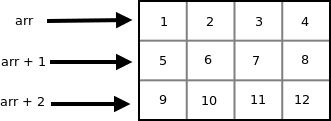
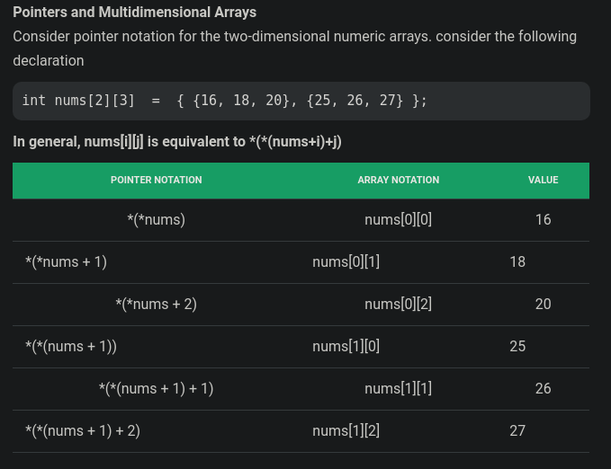
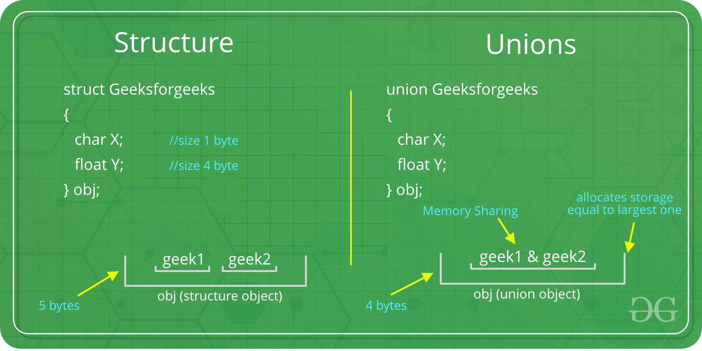
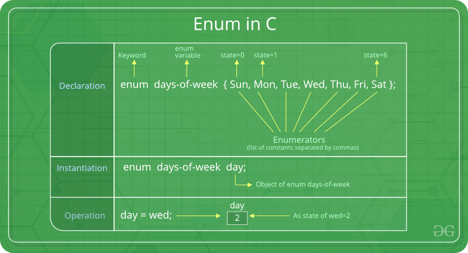

## Array
 arrays are always passed as pointers

## Strings
 - it is object which represent stream of chars
 - dynamic memory allocation

## Functions
 **Pass by value:** values of actual parameters are copied to function’s formal parameters. the two types of parameters are stored in different memory locations.

 **Pass by reference:**  Both actual and formal parameters refer to same locations, so any changes made inside the function are actually reflected in actual parameters of caller.
 
 ### Default function
  Once default value is used for an argument in function definition, all subsequent arguments to it must have default value. It can also be stated as default arguments are assigned from right to left.

  ```c++
        int fn(int a, int b=0, int c=0){
            return a+b+c;
        }

        int fn(int a, int b=0, int c){// error
            return a+b+c;
        }
        int fn(int a, int b, int c=0){
            return a+b+c;
        }
  ```
 ### void function
  we can write return inside void function, a void function can return a void function, or a void value.

  ```c++
        void work(){
            return (void)"Doesn't Print";  
        } 

        void test(){  
            return work(); 
        } 
  
  ```
 
 ## inline function
  - When the program executes the function call instruction, the CPU stores the memory address of the instruction

  - then copies the arguements of function to stack, then runs function code and stores the function return value to predefined memory and finally return control to calling function.

  - This can become overhead if the execution time of function is less than the switching time from the caller function to called function. This overhead occurs for small functions

  - inline function is a function that is expanded in line when it is called. When the inline function is called whole code of the inline function gets inserted or substituted at the point of inline function call by preprocessor
    ```c++
        inline return-type function-name(parameters){
            // function code
        }  
    ```
  - inline is a request to compiler and compiler can ignore it under following circumstances:
    1. called function contains loops, static variables, is recursive.
    2. If a function return type is other than void, and the return statement doesn’t exist in function body.
 
 ### Advantages
  - Function call overhead doesn’t occur.
  - It also saves the overhead of push/pop variables on the stack.

 ### Disadvantages
  - The added variables from the inlined function consumes additional registers.
  - If you use too many inline functions then the size of the executable file will be large, because of the duplication of same code.

 ## Function Overloading
  - Function overloading is a feature where two or more functions can have the same name but different parameters.
  - Function overloading can be considered as an example of polymorphism.
    ```c++
    #include <iostream> 
    using namespace std; 

    void print(int i) { 
        cout << " Here is int " << i << endl; 
    } 
    void print(double  f) { 
        cout << " Here is float " << f << endl; 
    } 
    void print(char const *c) { 
        cout << " Here is char* " << c << endl; 
    } 

    int main() { 
        print(10);// Here is int 10  
        print(10.10);// Here is float 10.1 
        print("ten");// Here is char* ten 
    }
    ``` 

  ### Functions that cannot be overloaded in C++ 
  - Function declarations that differ only in the return type. For example, the following program fails in compilation.
    ```c++
    int foo() {  
        return 10;  
    } 
    
    char foo() {  
        return 'a';  
    } 
     // will cause compile error
    ``` 

  - Functions with same name and parameters can't overloaded even if one of them is static
    ```c++
    class Test { 
        static void fun(int i) {} 
        void fun(int i) {}    
    }; 
     // will cause compile error
    
    class Test { 
        void fun(int i) {} 
        void fun(int i) {}    
    }; 
    // this will cause compiler error, very trivial
    ``` 
  
  - Parameter declarations that differ only in a pointer * versus an array [] are equivalent.
    ```c++
      int fun(int *ptr); 
      int fun(int ptr[]);
    // will cause compiler error
    ``` 
  
  - Parameter declarations that differ only in the presence or absence of const  are equivalent.
    ```c++
      int fun(const int ptr); 
      int fun(int ptr);
    // will cause compiler error
    ``` 
  ### Does overloading work with Inheritance?
    NO
    
  ```c++
    class Base { 
    public: 
        int f(int i){ 
            cout << "f(int): "; 
            return i+3; 
        } 
    }; 

    class Derived : public Base { 
    public: 
        double f(double d){ 
            cout << "f(double): "; 
            return d+3.3; 
        } 
    }; 

    int main(){ 
        Derived* dp = new Derived; 
        cout<<dp->f(3)<<endl;// f(double): 6.3
        cout << dp->f(3.3)<<endl;// f(double): 6.6 
        delete dp; 
        return 0; 
    }
  ```

  ### Can main() be overloaded in C++?
   - main is not reserved word in c++;
     ```c++
        void test(){
        int main = 10;
        cout<<main<<endl;
      }
     ```
   - main can be overloaded as a member function of a class.
     
     ```c++
        // will cause error
        void main(int a){ 
            cout << a << "\n"; 
            return 0; 
        } 
        int main(){
            main(3);
        }

        // this works
        class Test{ 
        public: 
            int main(int s){ 
                cout << s << "\n"; 
                return 0; 
            } 
            int main(char *s){ 
                cout << s << endl; 
                return 0; 
            } 
            int main(int s ,int m) { 
                cout << s << " " << m; 
                return 0; 
            } 
        }; 

        int main() { 
            Test obj; 
            obj.main(3);// 3
            obj.main("I love C++");// I love C++
            obj.main(9, 6);// 9 6
            return 0; 
        } 
     ```

 ## Pointer
  Pointers store address of variables or a memory location. an array name points to first element of array.
    
 
   ```c++
        int val = 10;
        int* ptr = &val;
        cout<<*(ptr);// dereferencing

        int arr[3]={1, 2, 3};
        int (*ptr)[3] = &arr;// Points to the whole array arr.
        int* p = arr;// Points to 0th element of the arr

        //The base type of p is int while base type of ptr is ‘an array of 3 integers’.
        
        cout<<ptr<<" "<<p<<endl;// 0x7ffe3b28ecbc 0x7ffe3b28ecbc
        
        // whenever a pointer to an array is dereferenced, we get the base address of the array to which it points
        cout<<*(ptr)<<endl;// 0x7ffe3b28ecbc
        
        p++;// will shift by 4
        ptr++;// will shift by 12
        
        cout<<ptr<<" "<<p<<endl;// 0x7ffe3b28ecc8 0x7ffe3b28ecc0

        cout<<>>
   ```
  

  ### Pointer in 2D array
   

   (arr) -> points to 0th element of 0th 1-D array

   (arr+1) -> points to 0th element of 1st 1-D array
   
   (arr+2) -> points to 0th element of 2nd 1-D array

   ```c++
        int arr[3][3]={{1, 2, 3}, {4,5,6}, {7,8,9}};
        cout<<*(*(arr))<<endl;// 1
        cout<<*(*(arr+1))<<endl;// 4 
        cout<<*(*(arr+2))<<endl;// 7
   ```

   

  ### Array Decay
   The loss of type and dimensions of an array when we pass the array into function by value or pointer.

   ```c++
        void aDecay(int *p){// pass by value 
            cout << sizeof(p) << endl;// 8
        } 
        
        void pDecay(int (*p)[5]){// pass by pointer 
            cout << sizeof(p) << endl;// 8
        } 

        void solution(int(&p)[5]){// pass by reference
            cout<<sizeof(p)<<endl;// 20
        }

        void test(){
            int a[5] = {1, 2, 3, 4, 5};
            cout<<sizeof(a)<<endl;// 20
            aDecay(a);
            pDecay(&a);
            solution(a);
        }
   ```
  
  ### Opaque Pointer
   Opaque pointer is a pointer which points to a data structure whose contents are not exposed at the time of its definition.One can’t know the data contained in Node structure by looking at the definition.
   ```c++
        Node* node;
   ```

  ### Dangling Pointer
   A pointer pointing to a memory location that has been deleted;
   ```c++
        int* ptr = new int;
        *(ptr) = 5;
        delete(ptr);
        // now ptr is a dangling pointer
        ptr = NULL;// no more a dangling pointer
   ```
  
  ### Void Pointer
  A pointer pointing to a location which doesn't have any type. Basically the type of data that it points to is can be any. If we assign address of char data type to void pointer it will become char Pointer, if int data type then int pointer and so on. 
   - Pointer arithmetic is not possible on pointers of void due to lack of concrete value and thus size.
   ```c++
        void* ptr;
        int x = 5;
        char c = 'a';

        ptr = &x;
        cout<<*((int*)ptr)<<endl;// 5

        ptr = &c;
        cout<<*((char*)ptr)<<endl;// a
   ```

 ### NULL Pointer
  NULL Pointer is a pointer which is pointing to nothing.
   ```c++
        int* ptr = NULL:// NULL pointer
   ```

 ### Wild Pointer
  A pointer which has not been initialized to anything (not even NULL).
   ```c++
        int* ptr:// wild pointer
        int* p:// wild pointer
        ptr = NULL:// no longer wild

        int x = 5;
        p = &x;// no longer wild
   ```
 
 ## References
  When a variable is declared as reference, it becomes an alternative name for an existing variable. has to be intialized while declaring. Under the hood, Reference is implemented using pointer.
   ```c++
        int x = 10; 
        int& ref = x; 
   ```
  ### Application:
   - Modify the passed parameters in a function

   -  Imagine a function that has to receive a large object. If we pass it without reference, a new copy of it is created which causes wastage of CPU time and memory. We can use references to avoid this

   - In For Each Loops to modify all objects.
     ```c++
        vector<int> vect{ 10, 20, 30}; 
        for (int &x : vect)  
            x = x + 5;
        // vect - 15 25 35 
     ```
   
  ###  Disadvantage over Pointer 
   - Once a reference is created, it cannot be later made to reference another object, This is often done with pointers.

   - References cannot be NULL. Pointers are often made NULL to indicate that they are not pointing to any valid thing.

  ### Advantage over Pointer
   - Pointers can be wild, but reference has to be intialized while declaration
   
  ### When to use what
   - **Reference:** In function parameters and return types
   - **Pointer:** passing NULL-pointer is needed. ex-  LinkedList implementation

  ### Can references refer to invalid location in C++?
   - Reference to value at uninitialized pointer.
     ```c++
        int *ptr; 
        int &ref = *ptr;  // Reference to value at some random memory location 
     ```
   - Reference to a local variable is returned.
     ```c++
        int& fun(){ 
            a = 10; 
            return a; 
        } 
        // Once fun() returns, the space allocated to it on stack frame will be 
        // taken back. So the reference to a local variable will not be valid.
     ```
 ## NaN
  NaN is an exception which usually occurs in the cases when an expression results in a number that can’t be represented.
   ```c++
        cout<<sqrt(-2)<< endl;// -nan 

        // to check nan
        if(isnan(sqrt(-2)))
            cout<<"Yes\n";// Yes
        else
            cout<<"No\n";
   ```
 ## this pointer
  this refers to current instance of the class. its uses:

  - When local variable’s name is same as member’s name
   ```c++
        class Test{ 
            private: 
                int x; 
            public: 
            void setX (int x){ 
                this->x = x;// 'this' pointer is used to retrieve the object's x 
            } 
        };
   ```
  - To return reference to the calling object
   ```c++
        Test& Test::set(int x){
            this->x = x; 
            return *this; 
        }  
        // When a reference to a local object is returned, the returned reference
        // can be used to chain function calls on a single object.

        int main(){
            Test obj1(5, 5); 
            obj1.func().func();
        }
   ```

  ## Dynamic Memory Allocation
   - When we do not know how much amount of memory would be needed for the program beforehand.

   - Dynamic memory allocation in refers to performing memory allocation manually by programmer during runtime. 
   
   - Dynamically allocated memory is allocated on Heap 
   
   - For dynamically allocated memory like, it is programmers responsibility to 
   deallocate memory when no longer needed.
   
   - If enough memory is not available in the heap to allocate, the "new" request indicates failure by throwing an exception of type std::bad_alloc

   - An example of dynamic allocation to be done on the stack is recursion where the functions are put into call stack in order of their occurrence and popped off one by one on reaching the base case

   ```c++
        int *p = NULL; 
        p = new int; 
        char *c = new char;

        int *p = new int(25);// intializing along with declaration
        int *arr = new int[10];
        delete p;
        delete[] arr;
   ```

 ## Structure 
  A structure is a user-defined data type which have data members and member functions. structure has by default scope public.
   ```c++
        struct Student{
            int roll;
            string name;
            int marks;

            void display(){
                cout<<roll<<" "<<name<<" "<<marks<<endl;
            }
        };

        void test(){
            Student r19 = {19, "Pradeep", 20};// intialization
            r19.display();// 19 Pradeep 20

            Student r20;
            r20.roll = 20;// intialization
            r20.name = "Mohan";
            r20.marks = 45;
            cout<<r20.name;// Mohan

            // structure pointer
            Student *s = new Student;
            s->name = "Mohit";
            cout<<s->name<<endl;// Mohit
        }

        // unique way to declare structure object
        struct Point { 
            int x, y; 
        } p1;// cannot declare more objets of Point anywhere
   ```
  
  ## Union
   Like Structures, union is a user defined data type. In union, all members share the same memory location.

   

   ```c++
        union Test { 
            int x; 
            char y; 
            void display(){
                cout<<x<<" "<<(int)y<<endl;
            }
        }; 

        void test(){
            Test t;
            t.x = 1;
            t.display();// 1 1
            t.y = 2;
            t.display();// 2 2
            
            // pointer 
            Test* p = new Test;
            p->x =1;
        }
   ```
  ### How is the size of union decided by compiler?
   Size of a union is taken according the size of largest member in union.
 
 ## Enum
  Enumeration (or enum) is a user defined data type. It is mainly used to assign names to integral constants.
    

  ```c++
        // The name of enumeration is "flag" and the constant
        // are the values of the flag. By default, the values
        // of the constants are as follows:
        // constant1 = 0, constant2 = 1, constant3 = 2 and 
        // so on.
        enum flag{constant1, constant2, constant3, ....... };

        enum week{Mon, Tue, Wed, Thur, Fri, Sat, Sun}; 

        void test(){
            enum week day; 
            day = Wed;
            cout<<day;// 2

            int i = Fri;
            cout<<i<<endl;// 4 

            for (i=Mon; i<=Sun; i++)       
                cout<<i<<" ";//  0 1 2 3 4 5 6
        }

        enum State {Working = 1, Failed = 0, Freezed = 0};
        // two enums names can have same value, also we can explicitly assign

        // We can assign values to some name in any order. All unassigned 
        // names get value as value of previous name plus one.
        enum day {sun = 1, mon, tues = 5, wed, thu = 10, fri, sat};

        for (int i=sunday; i<=saturday; i++)       
            cout<<i<<" ";//  1 2 5 6 10 11 12
        
  ```
 
 ## Structured Programming VS Procedural Programming
  Procedural Programming | Structured Programming
  ---------------------- | ----------------------
  program is divided into functions that perform specific tasks | program is divided into functions and modules
  Data is global, and all the functions can access global data. |
  Pascal | C

 ## Garbage Collection
  Garbage collection is a process where the objects that are no longer reachable are freed from memory. Not reachable object means that the object is no longer referenced by any variable. So when the program feels it is short on memory it will check if there are any objects which can be destroyed.