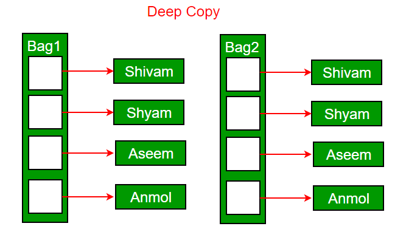

# OOPS
 Object-oriented programming aims to implement real-world entities like inheritance, hiding, polymorphism, etc in programming. The main aim of OOP is to bind together the data and the functions

 ## Class
  It is a user-defined data type, which holds its own data members and member functions. A class is like a blueprint for an object.
   - functions can be defined inside the class or outside, but functions defined inside class are **inline by default**.

 ## Object
  It is an instance of class. When a class is defined, no memory is allocated but when it is instantiated (i.e. an object is created) memory is allocated.
   - Each object gets its own copy of the data member
   - All-access the same function definition as present in the code segment
 
 ## Access Modifiers
  
  
  - **private:** inside the class or the friend functions or friend class are allowed to access the private data members

  - **protected:** it is same as private but protected members can be accessed on derived classed

  - **public:** can be accessed inside the class, derived class and outside the class(using object of that class)
 ## Constructors
  Constructors are special class members which are called by the compiler every time an object of that class is instantiated. It intiaizes objects of class.
   - Constructors don’t have return type
   - If we do not specify a constructor, C++ compiler generates a default constructor for us (expects no parameters and has an empty body). 
   ```c++
        class Point { 
        private: 
            int x, y; 
        
        public: 
            Point(int x1, int y1) { 
                x = x1; 
                y = y1; 
            } 
        }; 
   ```
 
 ## Types of Constructor
  

  ### Default Constructor
   A constructor without any arguments or with default arguements. We can even explicitly define default constructor.
   - The compiler will implicitly declare default constructor if not provided by programmer, will define it when in need. Compiler generates code for default constructor based on the situation.
   - It will not touch the data members.
   - if inheritance is there, then first default constructor of parent will be called
     ```c++
        class A { 
        public: 
            A(){// explicit default constructor 
                cout<<"A Constructor "; 
            }   
            int size; 
        }; 
        
        class B : public A { 
            // compiler defines default constructor of B, and 
            // inserts stub to call A constructor 
        }; 
        
        class C : public A { 
        public: 
            C(){ // User defined default constructor of C 
                // Compiler inserts stub to call A's construtor 
                cout<<"C Constructor "; 
                // compiler won't initialize any data of A 
            } 
        }; 
        
        class D { 
        public: 
            D(){ 
                // User defined default constructor of D 
                // a - constructor to be called bcoz a is instance of classA
                // compiler inserts stub to call A constructor 
                cout<<"D Constructor"; 
            } 
        
        private: 
            A a; 
        }; 

        void test(){
            B b;// A constructor
            C c;// A constructor C constructor
            D d;// A Constructor D Constructor
        }

     ```
   - If parameterised constructor is defined, then compiler doesn't create default constructor.
     ```c++
        class Human{ 
        private:
            string name;
        public: 
            Human(string name){ 
                cout<<"Human Constructor "; 
                this->name = name;
            }
            void displayHuman(){
                cout<<"name: "<<name<<endl;
            }
        };

        void test(){
            Human h;// error
        } 
     ```
   
   -  In default constructors data members are initialized in the same order as they appear in the class declaration.
     
      ```c++
        class Test { 
        private:     
            int y; 
            int x;     
        public: 
            Test() : x(10), y(x + 10) {};
            
            Test(int a, int b) : x(a), y(b) {};
            
            void print(){
                cout<<x<<" "<<y<<endl;
            } 
        }; 

        void test(){
            Test t;
            Test t2(1,2);
            
            // issue with default constructor
            t.print();// 10 32774

            // works fine with parameterised constructor
            t2.print();
        }


      ```

  ### Parameterized Constructors
   It is possible to pass arguments to constructors. Typically, these arguments help initialize an object when it is created.   
   - Whenever we define one or more non-default constructors(with parameters) for a class, a default constructor should also be explicitly defined as the compiler will not provide a default constructor in this case. However, it is not necessary but it’s considered to be the best practice to always define a default constructor.
   ```c++
        class Human{ 
        private:
            string name;
        public: 
            Human(string name){ 
                cout<<"Human Constructor\n"; 
                this->name = name;
            }
            void displayHuman(){
                cout<<"name: "<<name<<endl;
            }
        }; 
        
        class Student : public Human { 
        private:
            int roll;
        public:
            Student(string name, int roll): Human(name){
                this->roll = roll;
            }

            void displayStudent(){
                displayHuman();
                cout<<"roll: "<<roll<<endl;
            }
        }; 

        void test(){
            Human h("Anil");// Human Constructor
            h.displayHuman();// name: Anil

            Student s("Pradeep", 19);// Human Constructor
            s.displayStudent();// name: Pradeep \n roll: 19

            Human h("Anil");// impilicit call
            Human h = Human("Anil");// explicit call
        }
   ```

  ### Copy Constructor
   - A copy constructor is a member function which initializes an object using another object of the same class.
     ```c++
        // ClassName (const ClassName &old_obj)
        class Human{ 
        private:
            string name;
        public: 
            Human(string name){ 
                this->name = name;
            }

            Human(const Human& h){// copy constructor
                name = h.name;
            }

            void displayHuman(){
                cout<<"name: "<<name<<endl;
            }
            void change(string s){
                name = s;
            }
        }; 

        void test(){
            Human h1("Pradeep");
            Human h2 = h1;// copy constructor is called

            h1.displayHuman();// name: Pradeep
            h2.displayHuman();// name: Pradeep

            h1.change("Mohan");

            h1.displayHuman();// name: Mohan
            h2.displayHuman();// name: Pradeep
        }
     ```
   - copy constructor is called when:
     - When an object of the class is returned by value
     - When an object of the class is passed (to a function) by value as an argument.
     - When an object is constructed based on another object of the same class.
 
   - **copy constructor vs assignment operator**
     - Copy constructor is called when a new object is created from an existing object, as a copy of the existing object.
     - Assignment operator is called when an already initialized object is assigned a new value from another existing object
     ```c++
        Human p1("ram"), p2("laxman");
        
        Human p3 = p2;// copy constructor
        p1 = p2;// assignment operator
        

        
        p1.displayHuman();// laxman
        p2.displayHuman();// laxman

        p1.change("pradeep");
        
        p1.displayHuman();// pradeep
        p2.displayHuman();// laxman
     ```
  ### When is user-defined copy constructor needed?
   If we don’t define our own copy constructor, the C++ compiler creates a default copy constructor for each class which does a member-wise copy between objects like assignment operator does. The compiler created copy constructor works fine in general. We need to define our own copy constructor only if an object has pointers or any runtime allocation of the resource.

   - **Default constructor does only shallow copy**: ptr(memory address of object) is copied not value stored on it.

     

     ```c++
        class Human{ 
        private:
            string* name;
        public: 
            Human(string name){ 
                this->name = new string(name);
            }

            ~Human(){
                cout<<"destructor called\n";
                delete name;// if we do this runtime error bcoz 
                // h1 will delete name first, then h2 will again try
            }
            void displayHuman(){
                cout<<"name: "<<*name<<endl;
            }
            void change(string s){
                *name = s;
            }
        }; 

        void test(){
            Human h1("Pradeep");
            Human h2 = h1;

            h1.displayHuman();// Pradeep
            h2.displayHuman();// Pradeep

            h1.change("Mohan");

            h1.displayHuman();// Mohan
            h2.displayHuman();// Mohan

            // assignment operator
            Human p1("ram"), p2("laxman");
            p1 = p2;
            p1.displayHuman();// laxman
            p2.displayHuman();// laxman
            p1.change("pradeep");
            p1.displayHuman();// pradeep
            p2.displayHuman();// pradeep

     }
     ```

   - **Deep copy is possible only with user defined copy constructor**: In user defined copy constructor, we make sure that pointers (or references) of copied object point to new memory locations.
    
     ```c++
        class Human{ 
        private:
            string* name;
        public: 
            Human(string name){ 
                this->name = new string(name);
            }

            Human(const Human &h){// copy constructor
                name = new string(*(h.name));
            }

            ~Human(){
                delete name;
            }
            void displayHuman(){
                cout<<"name: "<<*name<<endl;
            }
            void change(string s){
                *name = s;
            }
        }; 

        void test(){
            Human h1("Pradeep");
            Human h2 = h1;

            h1.displayHuman();// Pradeep
            h2.displayHuman();// Pradeep

            h1.change("Mohan");

            h1.displayHuman();// Mohan
            h2.displayHuman();// Pradeep
        }
     ```
 
  ## Constructor Overloading
   ```c++
        class construct {  
        public: 
            float area;  
            construct(){// default constructor 
                area = 0; 
            } 
            
            // Constructor with two parameters 
            construct(int a, int b){ 
                area = a * b; 
            } 
            
            void disp(){ 
                cout<< area<< endl; 
            } 
        }; 
        
        int main() { 
            construct o; 
            construct o2( 10, 20); 
            
            o.disp(); 
            o2.disp(); 
        } 
   ```

 ## Destructor
  - Destructor is a member function which destructs or deletes an object.
  - Destructors don’t take any argument and don’t return anything
  
  ### When is destructor called?
   - a block containing local variables ends
   - a delete operator is called
     ```c++
        class Test { 
        private: 
            ~Test() {cout<<"destructor called";} 
        }; 
        int main(){ 
            Test* t = new Test; 
            delete t;// destructor called
        } 
     ```

  ### Can there be more than one destructor in a class?
   No, there can only one destructor in a class

  ### When do we need to write a user-defined destructor?
   When we have dynamically allocated memory or pointer in class
   

- ### if the destructor is private , then the object can only be deleted from inside the class as well.

- ### Private constructors are used to prevent creating instances of a class when there are no instance fields or methods