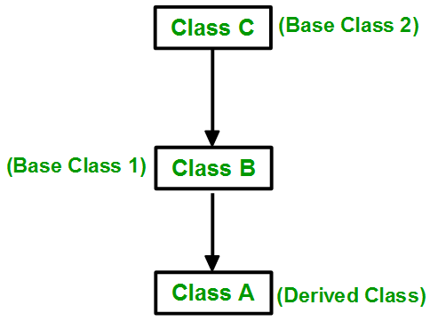
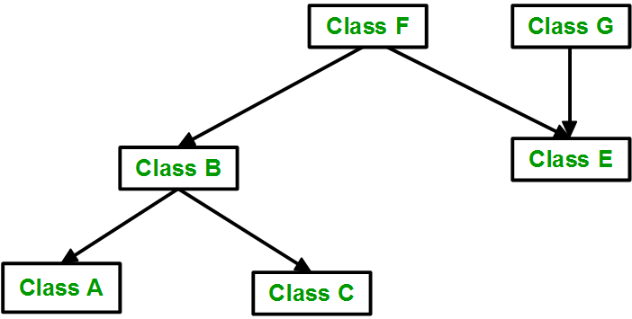
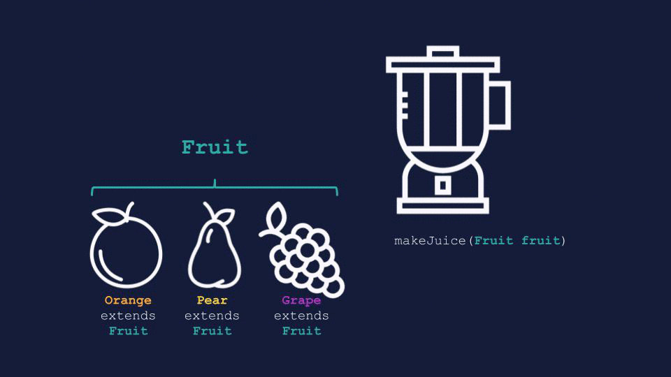

# Inheritance
 The capability of a class to derive properties and characteristics from another class is called Inheritance.
  ```c++
    class subclass_name : access_mode base_class_name{
        //body of subclass
    };
  ```
 
- **Sub Class:** The class that inherits properties from another class is called Sub class or Derived Class.

 - **Super Class:** The class whose properties are inherited by sub class is called Base Class or Super class.
  
  ```c++
    class Animal{
    public:
        void eats(){cout<<"eats\n";}
       
        ~Animal(){
            cout<<"Animal Destructor\n";
        }
    };

    class Human: public Animal{ 
    private:
        string name;
    public: 
        Human(string name){ 
            this->name = name;
        }

        ~Human(){
            cout<<"human destructor\n";
        }

        void displayHuman(){
            cout<<"name: "<<name<<endl;
        }
    }; 


    
    class Student : public Human { 
    private:
        int roll;
    public:
        Student(string name, int roll): Human(name){
            this->roll = roll;
        }

        ~Student(){
            cout<<"Student destructor\n";
        }

        void displayStudent(){
            eats();
            displayHuman();
            cout<<"roll: "<<roll<<endl;
        }
    }; 


    void test(){
        Student s("Pradeep", 19);
        s.displayStudent();
        // output:
        // eats
        // name: Pradeep
        // roll: 19
        // Student destructor
        // human destructor
        // Animal Destructor
    }
  ```
 Following are the things which a derived class doesn’t inherits from its parent :
 - The base class’s constructors and destructor.
 - The base class’s friends
 
 ## Modes of Inheritance
  - **public:** public member of the base class will remain public and protected members of the base class will remain protected.

  - **protected:** public member and protected members of the base class will become protected.

  - **private:**  public member and protected members of the base class will become private

    

 ## Types of Inheritance
  
  ### 1. Single inheritance
   

   ```c++
    class Human{ 
    private:
        string name;
    public: 
        Human(string name){ 
            this->name = name;
        }

        void display(){
            cout<<"name: "<<name<<endl;
        }

        void shoutOut(){
            cout<<"MSD LOVE\n";
        }
    }; 


    
    class Student : public Human { 
    private:
        int roll;
    public:
        Student(string name, int roll): Human(name){
            this->roll = roll;
        }

        void display(){
            display();// this will result into runtime error
                      // as it will keep calling itself
            
            Human::display();// This one calls Humans's display fn
        
            cout<<"roll: "<<roll<<endl;
        }
    }; 

    void test(){
        Student s("Pradeep", 19);
        s.shoutOut();// if child class doesn't have a fn but its parent has
                     // and it has access to that then it will call that
        
        s.display();// both child and parent has display(), so object calls its own

        s.Human::display();// specified, calls Human's display() fn
    }

   ```
    
  ## 2. Multiple Inheritance
   

   ```c++
    class Vehicle{ 
    public: 
        Vehicle(){ 
        cout<<"Vehicle Constructor"<<endl; 
        } 
        
        void display(){
            cout<<"I am vechile\n";
        }
        
        void shoutOut(){
            cout<<"mai vechile\n";
        }
    }; 
    
    class FourWheeler{
    public: 
        FourWheeler(){ 
        cout<<"FourWheeler constructor"<<endl; 
        }
        
        void display(){
            cout<<"I am FourWheeler\n";
        }
        
        void shoutOut(){
            cout<<"Mai FourWheeler\n";
        }
    };

    class Car: public Vehicle, public FourWheeler{
    public:
        Car(){
            cout<<"Car Constructor"<<endl;
        }

        void display(){
            cout<<"I am car\n";
        }
        
    };

    void test(){
        // The constructors of inherited classes are called in the same order
        // in which they are inherited, destructor reverse
        Car c;// Vehicle Constructor \n FourWheeler constructor \n Car Constructor
        
        // will call own(Car) display()
        c.display();// I am car
        
        c.shoutOut();//error, ambigous, confused 

        // specified
        c.Vehicle::shoutOut();// mai vechile  

        //specified
        c.FourWheeler::shoutOut();// mai vechile
    }

   ```
  ## Diamond Problem/ MultiPath Inheritance
   The diamond problem occurs when two superclasses of a class have a common base class. For example, in the following diagram, the TA class gets two copies of all attributes of Person class, this causes ambiguities
    
   

   ```c++
        class Person{
        protected:
            string name;
            int age;
        public:
            Person(){
                cout<<"Person constructor\n";
            }

            Person(string name, int age){
                cout<<"Person constructor\n";
                this->name = name;
                this->age = age;
            }
        };

        class Student: public Person{
        protected:
            int roll;
        public:
            Student(){
                cout<<"Student constructor\n";
            }

            Student(string name, int age, int roll):Person(name, age){
                cout<<"Student constructor\n";
                this->roll = roll;
            }
        };

        class Teacher: public Person{
        protected:
            int empId;
        public:
            Teacher(){
                cout<<"Teacher constructor\n";
            }

            Teacher(string name, int age, int empId):Person(name, age){
                cout<<"Teacher constructor\n";
                this->empId = empId;
            }
        };

        class TeachingAssistant: public Student, public Teacher{
        protected:
            string sub;
        public:
            TeachingAssistant(){
                cout<<"TeachingAssistant constructor\n";
            }

            TeachingAssistant(string name, int age, int roll, int empId, string sub): Teacher(name, age, empId), Student(name, age, roll){
                cout<<"TeachingAssistant constructor\n";
                this->sub = sub;
            }
        };

        void test(){
            TeachingAssistant ta("Pradeep", 22, 19, 70, "DSA");
            // output
            // Person constructor
            // Student constructor
            // Person constructor
            // Teacher constructor
            // TeachingAssistant constructor
            
            TeachingAssistant t;
            // output
            // Person constructor
            // Student constructor
            // Person constructor
            // Teacher constructor
            // TeachingAssistant constructor
        }
   ```

   In the above program, constructor of ‘Person’ is called two times.  Destructor of ‘Person’ will also be called two times. So object ‘ta’ and 't' has two copies of all members of ‘Person’, this causes ambiguities.
   ### Solution:
    The solution to this problem is ‘virtual’ keyword. We make the classes ‘Faculty’ and ‘Student’ as virtual base classes to avoid two copies of ‘Person’ in ‘TA’ class
   ```c++
        class Person{
        protected:
            string name;
            int age;
        public:
            Person(){
                cout<<"Person constructor\n";
            }

            Person(string name, int age){
                cout<<"Person constructor\n";
                this->name = name;
                this->age = age;
            }
        };

        class Student: virtual public Person{
        protected:
            int roll;
        public:
            Student(){
                cout<<"Student constructor\n";
            }

            Student(string name, int age, int roll):Person(name, age){
                cout<<"Student constructor\n";
                this->roll = roll;
            }
        };

        class Teacher: virtual public Person{
        protected:
            int empId;
        public:
            Teacher(){
                cout<<"Teacher constructor\n";
            }

            Teacher(string name, int age, int empId):Person(name, age){
                cout<<"Teacher constructor\n";
                this->empId = empId;
            }
        };

        class TeachingAssistant: public Student, public Teacher{
        protected:
            string sub;
        public:
            TeachingAssistant(){
                cout<<"TeachingAssistant constructor\n";
            }

            TeachingAssistant(string name, int age, int roll, int empId, string sub): Teacher(name, age, empId), Student(name, age, roll){
                cout<<"TeachingAssistant constructor\n";
                this->sub = sub;
            }
        };

        void test(){
            TeachingAssistant ta("Pradeep", 22, 19, 70, "DSA");
            // output
            // Person constructor
            // Student constructor
            // Teacher constructor
            // TeachingAssistant constructor

            
            TeachingAssistant t;
            // output
            // Person constructor
            // Student constructor
            // Teacher constructor
            // TeachingAssistant constructor
        }
   ```


  ## 3. Multilevel Inheritance
   

   ```c++
    class Animal{
    public:
        void eats(){cout<<"eats\n";}

        void display(){
            cout<<"Animal\n";
        }

        void shoutOut(){
            cout<<"Mai animal\n";
        }
    };

    class Human: public Animal{ 
    private:
        string name;
    public: 
        Human(string name){ 
            this->name = name;
        }

        void display(){
            cout<<"name: "<<name<<endl;
        }

        void shoutOut(){
            cout<<"Mai Human\n";
        }
    }; 


    
    class Student : public Human { 
    private:
        int roll;
    public:
        Student(string name, int roll): Human(name){
            this->roll = roll;
        }

        void display(){
            Human::display();
            cout<<"roll: "<<roll<<endl;
        }
    }; 

    void test(){
        Student s("Pradeep", 19);

        // call its own(Student) display()
        s.display();// name: Pradeep \n roll: 19

        // call eats inherited from Animal
        s.eats();// eats

        // calls its Parent(Human) shoutOut fn because its parent has already
        // override shoutout fn, so Student inherit Human shoutOut
        s.shoutOut();// Mai Human
    }   
   ```

  ## 4. Hierarchial Inheritance
   

   ```c++
    class Vehicle{ 
    public: 
        Vehicle(){ 
        cout<<"This is a Vehicle"<<endl; 
        } 
    }; 
    
    class Car: public Vehicle{ 
    
    }; 
    
    class Bus: public Vehicle{ 
        
    }; 
   ```

  ## 5. Hybrid (Virtual) Inheritance
   Hybrid Inheritance is implemented by combining more than one type of inheritance.
   
    
   ```c++
        class Vehicle{ 
        public: 
            Vehicle(){ 
                cout << "This is a Vehicle" << endl; 
            } 
        }; 
        
        class Fare{ 
        public: 
            Fare(){ 
                cout<<"Fare of Vehicle\n"; 
            } 
        }; 
        
        class Car: public Vehicle{ 
            //something
        }; 
        
        class Bus: public Vehicle, public Fare{ 
            //somethng
        }; 
   ```
  
 ## Polymorphism
  - The word polymorphism means having many forms. Eg- A man can be father, employee.
  
  - An important facet of polymorphism is the ability to use a child class object where an object of its parent class is expected.
  
  - if Orange is a Fruit through inheritance, you can then use Orange in the same contexts as Fruit 

  - Note that the reverse situation is not true; you cannot use a generic parent class instance where a child class instance is required. So an Orange can be used as a Fruit, but a Fruit cannot be used as an Orange.

    

    ```c++
    class Fruit{
    public:
        void display(){
            cout<<"I am Fruit\n";
        }
    };

    class Orange: public Fruit{
        public:
            // overidden function
            void display(){
                cout<<"I am Orange\n";
            }
    };

    void fruitDisplay(Fruit &fr){
        fr.display();
    }

    void test(){
        Orange o;

        o.display();// I am Orange

        // we passed orange but it called fruit's fn, so member fn is 
        // getting called according to type of pointer or reference 
        fruitDisplay(o);// I am fruit

        Fruit f = Orange();
        // will definately called fruit fn since it is a fruit object not reference
        f.display();// I am fruit

    }
    ```
  
 Now we want to call member functions based on **type of object a pointer or reference is pointing** not on type of pointer or reference. This is called Runtime Polymorphism

   

  ## Runtime Polymorphism / Late Binding
   ### Virtual Function
   - A virtual function is a member function which is declared within a base class and is overriden by a derived class, although not mandatory

   - When you refer to a derived class object using a pointer or a reference to the base class, you can call a virtual function for that object and execute the derived class’s version of the function.

   - Virtual functions cannot be static and also cannot be a friend function of another class.

   - Virtual functions should be accessed using pointer or reference of base class type to achieve run time polymorphism.

   - A class may have virtual destructor but it cannot have a virtual constructor.

   -  If we have created a virtual function in the base class and it is being overridden in the derived class then we don’t need virtual keyword in the derived class, functions are automatically considered as virtual functions in the derived class.

   ```c++
    class Fruit{
    public:
        virtual void display(){
            cout<<"I am Fruit\n";
        }

        void squeeze(){
            cout<<"Fruit Squeezed\n";
        }
    };

    class Orange: public Fruit{
    public:
        void display(){
            cout<<"I am Orange\n";
        }

        void squeeze(){
            cout<<"Orange Squeezed\n";
        }
    };

    void fruitDisplay(Fruit &fr){
        fr.display();
    }

    void test(){
        Orange o;

        o.display();// I am orange

        // Runtime Polymorphism
        fruitDisplay(o);// I am orange

        Fruit f = Orange(); 
        f.display();// I am Fruit

        Fruit *f = new Orange();

        // Late Binding
        f->display();// I am Orange
        
        // Early Binding
        f->squeeze();// Fruit Squeezed
    }
   ```

  ### How does the compiler perform runtime resolution?
   The compiler maintains two things to serve this purpose:
   - **vtable:** A table of function pointers, maintained per class.
   - **vptr:** A pointer to vtable, maintained per object instance
    
     ```c++
        class Employee { 
        public: 
            virtual void raiseSalary(){ 
            } 
        
            virtual void promote(){ 
            } 
        }; 
        
        class Manager : public Employee { 
            void raiseSalary(){ 
            } 
        
            void promote() { 
            } 
        }; 
        
        void globalRaiseSalary(Employee* emp[], int n){ 
            for (int i = 0; i < n; i++) 
                emp[i]->raiseSalary(); 
        } 
     ```
     

   - when an object is created, compiler sets vptr of object to vtable of the class
   
   - Wherever a polymorphic call is made, the compiler inserts code to first look for vptr using base class pointer or reference. Once vptr is fetched, vtable of derived class can be accessed. Using vtable correct function can be called

 ## Compile Time Polymorphism / Early Binding
  ## 1. Operator Overloading
   - class can only have operator overloading
   ```c++

    // this will result into error as int is not class
    int operator - (const int& s1, const int& s2){
        return (s1+s2);
    }

    string operator - (const string& s1, const string& s2){
        return (s1+s2);
    }

    // or
    // string operator - (string s1, string s2){
    //    return (s1+s2);
    //}

    void test(){
        string s1 = "ram";
        string s2 = "kumar";
        string s = s1 - s2;
        cout<<s<<endl;// ramkumar
    }


    class Complex{
    private:
        int real;
        int img;
    public:
        Complex(int x=0, int y=0){
            real = x;
            img = y;
        }

        Complex operator + (const Complex &obj){
            Complex res;
            res.real = real + obj.real;
            res.img = img + obj.img;
            return res;
        }

        void print(){
            cout<<real<<" + i"<num = num;
        }

        Test* operator -> (void){
            return this;
        }

    };

    class Derived: public Test{
    public:
        Derived(int x=4):Test(x){

        }
    };

    void test(){
        Derived* ptr = new Derived();
        cout<<ptr->num<<endl;// 4
    }
  ```
  ### some important operator overloading:
   **1. post increment and pre increment**
   ```c++
    class Test{
        int no;
    public:
        Test(int no=0){
            this->no = no;
        }

        void operator ++(){// pre increment
            no = no+1;
        }
        
        void operator ++(int){// post increment
            no = no+1;
        }

        void display(){
            cout<<"number: "<<no<<endl;
        }
    };

    void test(){
        Test t;
        ++t;
        t.display();
        t++;
        t.display();

    }
   ```
   
   **2. [] operator**
   ```c++
    class Test{
        int n;
        int *arr;
    public:
        Test(int n=3){
            this->n = n;
            arr = new int[3];
            arr[0] = 1;
            arr[1] = 2;
            arr[2] = 3;
        }

        int operator[](int i){
            return arr[i];
        }
    };

    void test(){
        Test t;
        cout<<t[1]<<endl;// 2
    }
   ```
   
   **3. -> operator**
   ```c++
    class Test{
    public:
        int num;
        Test(int num=3){
            this->num = num;
        }

        Test* operator -> (void){
            return this;
        }

    };

    void test(){
        Test* ptr = new Test();
        cout<<ptr->num<<endl;// 3
    }
   ```
 ## Final Keyword
  - used in virtual function to restrict being overridden in derived class.
    ```c++
        class Base 
        { 
        public: 
            virtual void myfun() final 
            { 
                cout << "myfun() in Base"; 
            } 
        };
    ```
  - used in class to restrict being inherited

    ```c++
        class Base final 
        { 
        }; 
        
        class Derived : public Base 
        { 
        };
    ```

 ## Abstract
  - cannot decide fn's implementation so we declare it abstract
  - having pure virtual or abstract fn(virtau int fn() = 0;)
    ```c++
        class Test 
        {    
            // Data members of class 
        public: 
            // Pure Virtual Function 
            virtual void show() = 0; 
            
        /* Other members */
        }; 
    ```
  - we cannot declare abstract class object but can't have pointer
  - derived class which do not override becomes abstract

 
 ## Abstraction
  Abstraction means displaying only essential information and hiding the details. Data abstraction refers to providing only essential information about the data to the outside world, hiding the background details or implementation.

 ## Encapsulation
  Encapsulation is defined as wrapping up of data and information under a single unit. In Object Oriented Programming, Encapsulation is defined as binding together the data and the functions that manipulates them.